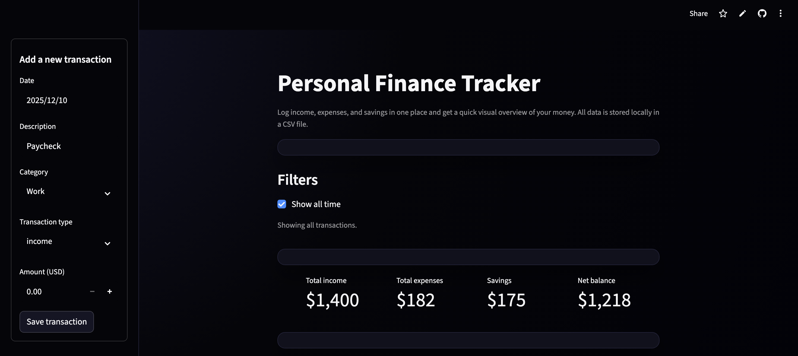
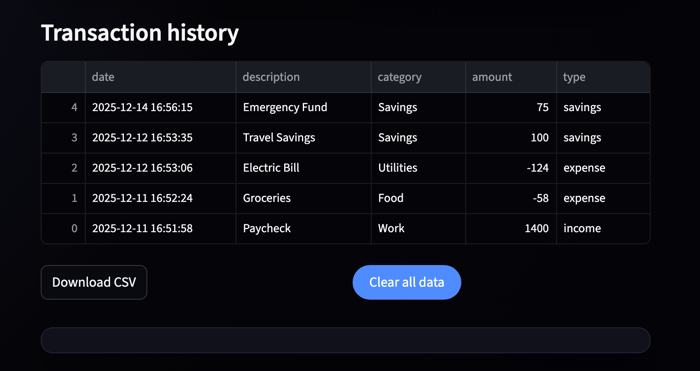
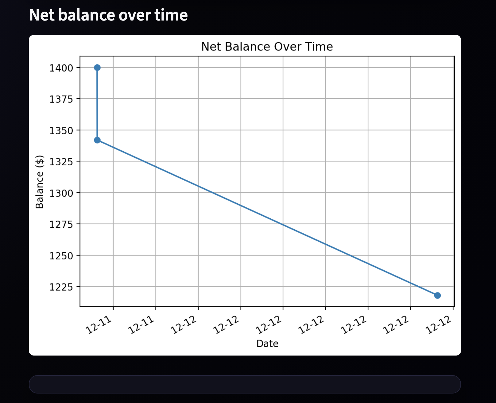
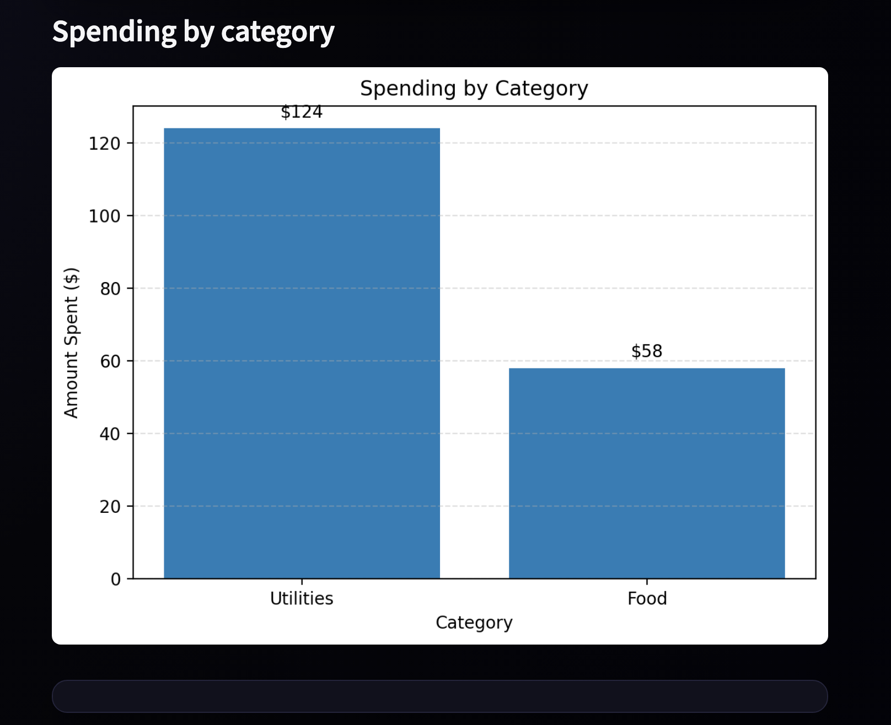
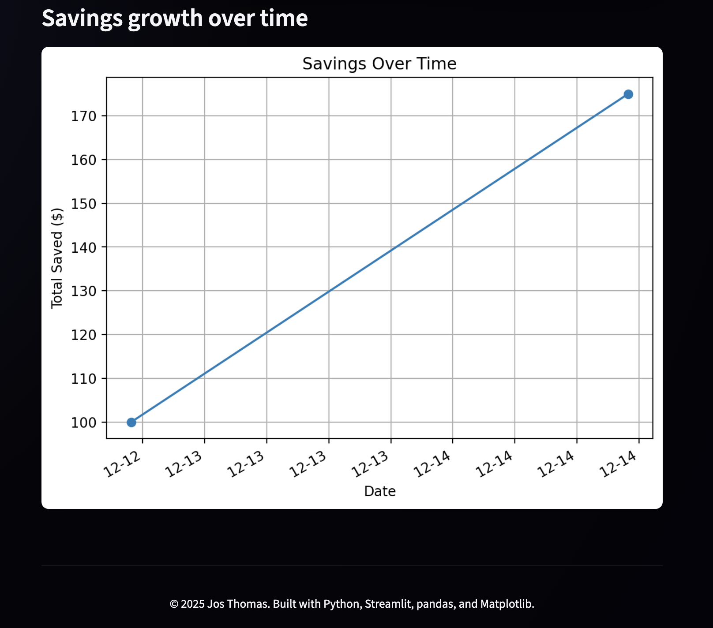

# Personal Finance Tracker

**Author:** Jos Thomas  
**Project Type:** Personal Software Engineering & Data Visualization Project  
**Technologies:** Python, Streamlit, pandas, Matplotlib, Local CSV Storage

---

## Project Overview

This project is a lightweight personal finance dashboard built with Python and Streamlit. It lets me log income, expenses, and savings, then instantly see trends through clean charts and summary metrics. Everything is saved locally to a CSV file, so the data persists between sessions without needing a database or backend server.

I built this project to get better at structuring small software tools, managing application state, handling real data, and building quick dashboards that feel smooth and professional. It also helped me practice organizing a Python project, adding UI polish, and deploying a Streamlit app.

---

## Features

- Add income, expenses, and savings  
- Filter transactions by date or view all time  
- Categorize spending (Food, Housing, Utilities, etc.)  
- Automatic calculation of:  
  - Total income  
  - Total expenses  
  - Total savings  
  - Net balance  
- Transaction history table with CSV download  
- Savings goal progress bar  
- Clean, dark, custom-themed UI  
- Three built-in charts:  
  - **Net balance over time**  
  - **Spending by category**  
  - **Savings growth over time**  
- Local CSV storage for persistence  

---

## Technologies Used

- **Python** for all application logic  
- **Streamlit** for the UI and component system  
- **pandas** for data processing and filtering  
- **Matplotlib** for plotting and visualization  
- **CSV storage** for simple, local persistence  
- **Custom CSS** (in Streamlit) for styling animations, glow effects, and layout improvements  

---

## How to Run the Project

### Option 1: Run Locally with Streamlit (Recommended)

1. Clone the repository  
2. Install dependencies  
   ```bash
   pip install -r requirements.txt
   ```
3. Run the app  
   ```bash
   streamlit run finance_tracker_app.py
   ```
4. The dashboard will open in your browser.

---

### Option 2: Run on Streamlit Cloud

If you're viewing this on GitHub, you can also deploy your own version on Streamlit Cloud by pressing **Deploy** and selecting this repository.

---

## What I Learned From This Project

Through this project, I learned how to:

- Manage application state in Streamlit  
- Structure a Python project with UI, data processing, and visualization  
- Build dynamic charts that update from real user data  
- Store and clean real user input  
- Handle empty states and prevent runtime errors  
- Apply custom theming and animations using CSS  
- Deploy a Python dashboard using GitHub and Streamlit Cloud  

---

## Future Improvements

Some improvements I would like to add in the future include:

- Monthly spending summaries  
- Budget caps with alerts  
- CSV import to load historical financial data  
- Recurring transactions (rent, bills, subscriptions)  
- Mobile-optimized layout  
- Light mode toggle  
- User-defined spending categories  

---

## Screenshots

### Main Dashboard


### Transaction History


### Net Balance Over Time


### Spending by Category


### Savings Goal


### Savings Growth Over Time



## Disclaimer

This project was built for learning, portfolio use, and educational purposes. It is not intended to replace professional financial tools.
